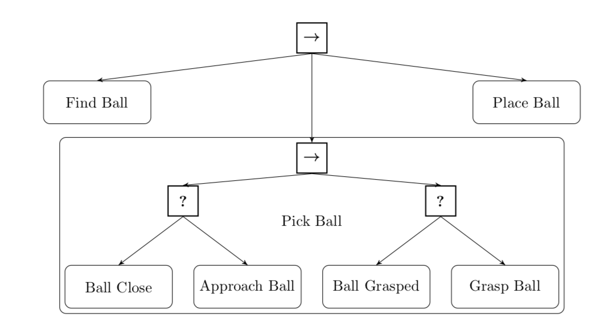
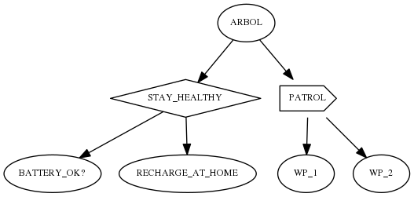

#Práctica 2. Programación de tareas en robots móviles
##Noviembre 2018
##Otto Colomina Pardo, Sergio Orts Escolano


En esta práctica vamos a programar un robot móvil para que realice una tarea compleja que implique navegar por el entorno realizando una serie de subtareas. La tarea puede ser la que queráis, por ejemplo:

- Patrullar por un edificio pasando por diversos puntos y detectando posibles "intrusos"
- Navegar por una habitación detectando objetos tirados por el suelo y recogiéndolos si el robot tiene un brazo capaz de ello
- Navegar por un entorno en que el robot va detectando señales (por ejemplo flechas) que le van indicando a dónde ir
- Intentar localizar una pelota en el suelo e irla empujando para marcar gol en una portería

> NOTA: según sea la tarea que diseñéis es posible que no la podáis probar más que en simulación. Se valorarán las pruebas en los Turtlebot reales (y además son más divertidas que las simulaciones :)) pero también podéis usar otros modelos de robots distintos y simplemente simularlos en ROS.

La tarea puede ser muy diversa pero en general vais a necesitar tres tipos de elementos para implementarla:

- Un formalismo para especificar **cómo se coordinan las subtareas**: por ejemplo habrá subtareas que se deberán realizar en una secuencia ("primero ve al *waypoint* 1 y luego al 2"), otras serán condicionales ("navega aleatoriamente hasta que te encuentres una pelota"), otras tareas serán en paralelo... En robótica para coordinar este tipo de subtareas se pueden usar varios mecanismos, como las máquinas de estados finitos y los *behavior trees*.
- Algunas subtareas pueden requerir ***navegar* a puntos concretos del mapa** (por ejemplo una tarea de vigilancia). Para eso podéis usar el *stack* de navegación de ROS que se explica en la sección siguiente.   
- Otras subtareas serán de **detección de condiciones** (por ejemplo, "detectar si estoy en un pasillo", o "buscar una pelota de color rojo"). Para estas tendréis que hacer uso de los sensores del robot.


## El *stack* de navegación de ROS

El *stack* de navegación de ROS es un conjunto de nodos, de distintos paquetes, que sirven para gestionar las tareas de navegación en robots móviles. Básicamente el *stack* nos permite mover el robot a un destino siguiendo un camino "razonablemente" corto (puede no ser el óptimo) y a la vez evitando los obstáculos. Estos pueden ser de dos tipos: los que están reflejados en el mapa (paredes, vallas, ...) y los obstáculos "temporales" que se va encontrando por el camino (sillas, personas, ...). Por tanto el *stack* de navegación usará tanto información del mapa (que habéis construido en la práctica anterior) como datos de los sensores (laseres, sonares, cámara,...).

La siguiente figura, tomada de [esta presentación](https://www.dis.uniroma1.it/~nardi/Didattica/CAI/matdid/robot-programming-ROS-introduction-to-navigation.pdf) muestra la estructura del *stack*. Como puede verse es bastante compleja.


Fijáos en que el *stack* necesita localizarse y por tanto necesita un mapa, por lo que **tendréis que disponer del mapa** en formato YAML para el entorno que estéis probando.

### Probar el *stack* de navegación con el Turtlebot simulado

Como se puede apreciar en la figura anterior el *stack* está formado por muchos nodos y ponerlos todos en marcha simultáneamente puede resultar complicado. Afortunadamente en los paquetes de turtlebot que hay instalados tenemos un par de *demos* que nos pueden servir:

Para probar con el simulador Gazebo (en 3D) y el mundo por defecto (`playground.world`)

```bash
#simulador
roslaunch turtlebot_gazebo turtlebot_world.launch
#stack de navegación
roslaunch turtlebot_gazebo amcl_demo.launch
#rviz para visualizar el resultado y poder fijar destinos
roslaunch turtlebot_rviz_launchers view_navigation.launch
```

Una vez puesto todo en marcha, puedes probar en `rviz` a fijar un destino para el robot. Clica en el botón que aparece en la barra superior llamado `2D Nav Goal`. Luego clica en el punto del mapa al que quieres que se mueva el robot y opcionalmente arrastra para indicar la orientación final del robot. Si hay un camino factible el robot debería seguirlo y moverse hasta el destino.

Esto también lo puedes hacer por código, bien sea en C++ o en python, como verás en el apartado siguiente.

> NOTA: ya veremos en clase de teoría con más detalle cómo funciona el *stack* de navegación. De momento podéis observar en los nodos de rviz (panel izquierdo) que hay un `Local Planning` (evitar obstáculos basándose en lo que detectan los sensores) y un `Global Planning` (planificar la mejor trayectoria según el mapa, sin chocar con los obstáculos reflejados en él)

Si quieres usar un mundo propio tendrás que hacerlo de este modo:

```bash
#simulador
roslaunch turtlebot_gazebo turtlebot_world.launch world_file:=<trayectoria al fichero con el mundo>
#stack de navegación
roslaunch turtlebot_gazebo amcl_demo.launch map_file:=<trayectoria al .yaml del mapa>
#rviz se lanza igual
roslaunch turtlebot_rviz_launchers view_navigation.launch
```

También podéis probar con el simulador *stage* (un simulador ligero en "2D y 1/2", apropiado para máquinas que no sean demasiado potentes)

```bash
#Esto lanza el simulador, el stack de navegación y rviz todo en uno
roslaunch turtlebot_stage turtlebot_in_stage.launch
```

## Especificación de tareas con Behavior Trees

Aunque podríamos especificar cómo se van coordinando las subtareas simplemente con las construcciones habituales de nuestro lenguaje de programación (`if else`, `while`,...) en general esta forma no se suele recomendar por generar código demasiado *ad hoc*, "embrollado" y poco reutilizable. En su lugar ese pueden usar otros formalismos que nos permitan encapsular las tareas de forma más modular, reutilizable y entendible. Los dos formalismos más conocidos de este tipo son las máquinas de estados finitos y los *behavior trees*. Vamos a usar estos últimos en esta práctica, aunque también podéis implementar las primeras para comparar ambos enfoques.

### Introducción básica a los *behavior trees*

Son estructuras de datos en forma de árbol en que los nodos representan las subtareas y la forma de combinarlas. 



- Los árboles son síncronos. Cada cierto número de milisegundos se produce un *tick* del reloj, que quiere decir que el árbol se "ejecuta"
- La "ejecución" del árbol comienza en la raíz y va bajando hacia las hojas, siempre de izquierda a derecha y para cada nodo visitando su subárbol entero (técnicamente es un recorrido *preorden*).
- Cada nodo tras terminar su ejecución puede devolver uno de tres resultados: SUCCESS, RUNNING o FAILURE 
- Los nodos "hoja" son condiciones o acciones. Por ejemplo "¿Estoy en un pasillo?" o "recoger el objeto"
- Los nodos "interiores" coordinan las condiciones o acciones. En un lenguaje de programación clásico serían las instrucciones básicas de control de flujo: condicional o secuencia
    - Los *selectores* (o *fallbacks*) van ejecutando cada uno de sus hijos hasta que uno devuelve SUCCESS. Es decir, funcionan de manera parecida al `switch` de C, si se "cumple" una rama no seguimos mirando las demás.
    - Los nodos *secuencia* van ejecutando cada uno de los hijos hasta que uno falla (FAILURE). La lógica de esto es que en una secuencia de pasos si uno falla no tiene sentido continuar con el siguiente.

### *Behavior trees* en ROS

Hay varias librerías de *behavior trees* que incluyen integración con ROS. Aquí vamos a usar [`pi_trees`](https://github.com/pirobot/pi_trees) como ejemplo, pero si queréis podéis emplear otra. 

Para instalar la librería, **moverse al `src` del *workspace*** de ROS y allí hacer

```bash
#de momento usamos este repositorio para que el código nos funcione en el laboratorio
#nota: no hay versión específica para kinetic, pero esta funciona
git clone -b indigo-devel https://github.com/ottocol/pi_trees/
cd ..
catkin_make
source devel/setup.bash
##La siguiente instrucción solo si estás en tu equipo, NO en los ordenadores del laboratorio
sudo apt-get install graphviz-dev libgraphviz-dev python-pygraph python-pygraphviz gv
```

> NOTA: de momento en el laboratorio nos falta un paquete de software necesario para que la librería pueda dibujar los árboles. Por eso en lugar de importar el software de su repositorio original (`https://github.com/pirobot/pi_trees`) estamos usando una copia modificada.

Ahora podemos probar un ejemplo. Vamos a ver cómo funciona el árbol representado en la siguiente figura



Además de los tipos de nodos ya nombrados y estándares en *behavior trees* esta librería tiene algunos tipos de nodos más para poder integrarse con ROS:

- `MonitorTask`: monitoriza los mensajes de un determinado *topic*. En el ejemplo, el nodo `BATTERY_OK?` es de este tipo
- `SimpleActionTask`: permite enviar acciones. Lo más habitual será enviar destinos al paquete `move_base` del *stack* de navegación. En el ejemplo, los nodos `RECHARGE_AT_HOME`, `WP_1` y `WP_2` son de este tipo.

Bajáos el archivo [`patrol_tree.py`](https://gist.githubusercontent.com/ottocol/545c7fd2098d6cb561e9bf730bb47d5e/raw/a3840264cf53faa115224aefd4885a41b7efdc7b/patrol_tree.py), que implementa este ejemplo y colocadlo en la carpeta `src/pi_trees/pi_trees_ros`.

Para que sea ejecutable habrá que darle permisos

```bash
chmod ugo+x patrol_tree.py
```
Ya podemos probar el ejemplo:

```bash
#en una terminal ponemos en marcha el stack de navegación y el simulador
roslaunch turtlebot_stage turtlebot_in_stage.launch
#en otra terminal ponemos en marcha el ejemplo
rosrun pi_trees_ros patrol_tree.py
```

Se creará el árbol, aparecerá impreso en modo texto y se pondrá en marcha. En un principio el robot no se moverá porque el nodo `BATTERY_OK` está esperando recibir algún mensaje de tipo `battery_level` y no se ha recibido ninguno por lo que el nodo estará *running* y el procesamiento acaba aquí. Si enviamos manualmente desde la terminal un mensaje del tipo esperado podremos cambiar el estado del nodo:

```bash
rostopic pub /battery_level std_msgs/Int32 100
```

Como la batería está a un nivel de 100, el nodo `BATTERY_OK` devolverá `SUCCESS` (mirad el código fuente para los detalles). Al ser el "padre" de `BATTERY_OK` un selector, este devuelve inmediatamente también `SUCCESS` sin entrar en el nodo siguiente. Como el padre de `BATTERY_OK` es una secuencia y ha tenido éxito el primero de los nodos, pasa al segundo, `PATROL`. Este pasa a ejecutar su primer hijo que es `WP_1`, una acción que mueve al robot a un determinado punto. Cuando llegue al destino y `WP_1` pase a SUCCESS pasará a ejecutarse `WP_2`.

Si en cualquier momento ponemos la batería en un nivel por debajo de 30:

```bash
rostopic pub /battery_level std_msgs/Int32 100
```

En el siguiente *tick* el `BATTERY_OK` devolverá FAILURE, con lo que el padre que es un selector intentará ejecutar el siguiente hijo. Este es el nodo `RECHARGE_AT_HOME` que hace que el robot vuelva al punto inicial.

## Entrega de la práctica

### Material a entregar

La documentación de la práctica es una parte muy importante en la puntuación final. Se debe entregar documentación (en cualquier formato: PDF, HTML, etc.) con los siguientes puntos:

1. Indice del contenido de la práctica 
2. Contenido de la práctica: 
    - Explicación de la tarea que se quiere abordar
    - Si usáis *Behavior trees* o máquinas de estados finitos
       - Esquema global del árbol o máquina de estados y descripción general de su comportamiento
       - Descripción de cada uno de los nodos, detallando en su caso los algoritmos/métodos que haya usado cada uno de ellos: por ejemplo si un nodo busca objetos de color azul decir cómo lo habéis hecho.
    - Si no usáis árboles/máquinas de estados, explicad cómo se combinan todas las funciones/clases/módulos de vuestro código para realizar la tarea
    - Experimentos realizados en simulación y si es posible con el robot real
3. Conclusiones/discusión.

Además de la documentación anterior también debéis entregar todo el **código fuente** que hayáis realizado. En el código debéis incluir comentarios indicando qué hace cada clase y cada método o función.

### Baremo

- Como es lógico la nota estará relacionada con la dificultad de la tarea pero también con la documentación de la práctica. Debéis no solo documentar la implementación que habéis hecho sino también **todos** los experimentos realizados en simulación y con el robot real (¡aun los que no funcionen!, en estos podéis analizar qué es lo que no ha funcionado y cómo lo pretendéis resolver)
- Para sacar hasta un 6 podéis implementar la tarea en ROS simplemente usando C++/Python sin necesidad de usar ningún formalismo adicional.
- Para una nota hasta el 8, usad *behavior trees*  o máquinas de estados finitos para modelar las subtareas 
- Para una nota superior a 8, alguna de estas ideas (u otras que podéis proponer a los profesores) 
    - Implementar tareas que hagan uso de visión: colores, formas, reconocimiento de objetos. Podéis usar cualquier paquete ROS/librería de terceros que encontréis. La nota dependerá de la dificultad de uso y también de la experimentación realizada. 

### Plazo y procedimiento de entrega

- La práctica se entregará **antes de las 24 horas del domingo 23 de diciembre de 2018**.
- La entrega se realizará a través del UACloud de la Universidad de Alicante. Se habilitará una entrega específica para subir el código fuente y la memoria asociada a la práctica.

