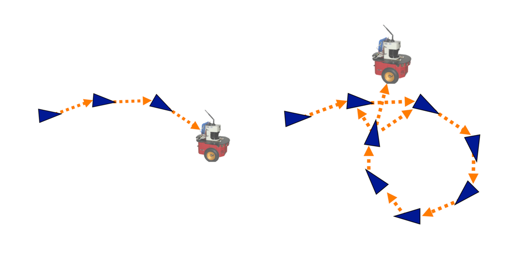

<!-- .slide: class="titulo" -->
# Robots móviles <!-- .element: class="column half" -->
## SLAM basado en Grafos <!-- .element: class="column half" -->

---

<!-- .slide: class="titulo" -->
# Índice <!-- .element: class="column half" -->

    <h2>Introducción</h2> 
    <h2>El frontend</h2>
    <h2>El backend</h2> 

---

<!-- .slide: class="titulo" -->
# Introducción <!-- .element: class="column half" -->
## SLAM basado en grafos <!-- .element: class="column half" -->

---

- Formamos un grafo cuyos nodos son *poses* del robot y cuyos arcos son *restricciones* o relaciones entre las poses
- Estas restricciones tienen asociada una incertidumbre
- Cuando observamos *landmarks* ya vistos introducimos restricciones entre poses no sucesivas

 <!-- .element: class="stretch" -->

---

<!-- .slide: data-background-image="imag_graph_based_slam/conceptual_network.jpg" data-background-opacity="0.3"-->

Es como si tuviéramos una red de nodos unidos por "bandas elásticas". Cada restricción "tira" en una dirección y su "flexibilidad" es proporcional a su incertidumbre

---

Cerrar el ciclo ayuda a "corregir" el grafo

 <!-- .element: class="stretch" -->

---

Los sistemas se dividen habitualmente en 2 partes:

- *Frontend:* construir el grafo basándose en odometría+sensores
- *Backend:* optimizar las restricciones

 <!-- .element: class="stretch" -->

---

<!-- .slide: class="titulo" -->
# El *frontend* 
<!-- .element: class="column half" -->
## Construir el grafo 
<!-- .element: class="column half" -->

---

- Los **nodos** del grafo son las *poses* $x={x_1, x_2,...x_n}$ del robot para cada instante
- Crearemos un **arco** entre $x_i$ y $x_j$ si:
    + Tenemos una medida de odometría entre ambas poses  
    + Observamos el mismo *landmark* o la misma parte del entorno desde ambas poses

---

## Observación

Añadiremos una restricción entre $x_i$ y $x_j$ si identificamos que estamos viendo lo mismo desde estas dos poses 

- El mismo *landmark*
- En mapas tipo rejilla: con *scanners* tipo láser 2D/3D podemos hacer *scan matching*

<iframe width="560" height="315" src="https://www.youtube.com/embed/sIMM73Was74" frameborder="0" allow="accelerometer; autoplay; encrypted-media; gyroscope; picture-in-picture" allowfullscreen></iframe>

Paquete [laser_scan_matcher](http://wiki.ros.org/laser_scan_matcher) de ROS 
<!-- .element: class="caption" -->

---

## Observación (II)

En realidad de momento nos da lo mismo la observación, lo que queremos es saber cuánto *nos hemos movido* entre $x_i$ y $x_j$, es decir la *transformación* que solapa ambas medidas

 <!-- .element: class="stretch" -->

Es como si hubiéramos medido $x_j$ desde $x_i$ (medida "virtual")

---

## Arco para una observación "virtual"

 <!-- .element: class="stretch" -->

---

<!-- .slide: class="titulo" -->
# El *backend*
<!-- .element: class="column half" -->
## Resolver la optimización
<!-- .element: class="column half" -->

---

## ¿Qué queremos optimizar?

- Para cada arco tenemos un error $e_{ij}$ que queremos minimizar
- Minimizaremos los errores al cuadrado: $e^T_{ij} \Omega_{ij} e_{ij}$, donde $\Omega_{ij}$ es la inversa de la matriz de covarianza $\Sigma_{ij}$
- Es un problema no lineal ya que tanto el modelo de movimiento como el del sensor lo son

---

## Mínimos cuadrados

- En resumen, queremos minimizar la suma de todos los errores al cuadrado
- Los métodos de mínimos cuadrados son apropiados para este tipo de problemas, donde tenemos muchas más ecuaciones que incógnitas
- Hay varios algoritmos "estándar" para el caso no lineal: Gauss-Newton, Levenberg-Marquardt,...

---

Hay varios *backend* de código abierto disponibles en internet, por ejemplo:

- GTSAM (Georgia Tech Smoothing and Mapping Library) [https://bitbucket.org/gtborg/gtsam.git](https://bitbucket.org/gtborg/gtsam.git)
- HOG-Man (Hierarchical Optimization for Pose Graphs on Manifolds): [https://openslam-org.github.io/hog-man.html](https://openslam-org.github.io/hog-man.html) 
- TreeMap: [https://openslam-org.github.io/treemap.html](https://openslam-org.github.io/treemap.html) (según la documentación puede optimizar un grafo de 1 millón de nodos en medio segundo)
- TORO - Tree-based netwORk Optimizer (aplica descenso por gradiente) [https://openslam-org.github.io/toro.html](https://openslam-org.github.io/toro.html)

---

Una vez hemos recuperado las poses del robot, para obtener el mapa podemos aplicar algún algoritmo de mapeado con poses conocidas

---

## Ejemplo: LSD-SLAM

SLAM monocular, reconstruye un mapa semi-denso, funciona en tiempo real sin GPU

<iframe width="560" height="315" src="https://www.youtube.com/embed/GnuQzP3gty4" frameborder="0" allow="accelerometer; autoplay; encrypted-media; gyroscope; picture-in-picture" allowfullscreen></iframe>

---

## Referencias

- A tutorial on Graph-Based SLAM, G. Grisetti, R.Kümmerle, C.Stachniss &  W.Burgard [pdf](http://www2.informatik.uni-freiburg.de/~stachnis/pdf/grisetti10titsmag.pdf)