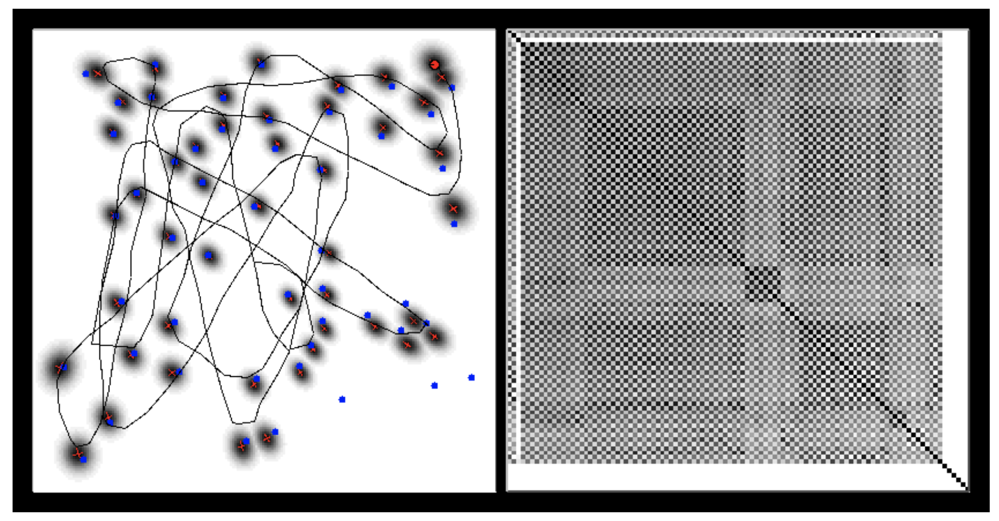

<!-- .slide: class="titulo" -->

# Robots móviles <!-- .element: class="column half" -->

## SLAM (Mapeado y Localización Simultáneos) <!-- .element: class="column half" -->

---

<!-- .slide: class="titulo" -->

# Índice <!-- .element: class="column half" -->

<h2>Introducción al problema del SLAM </h2>
<h2>SLAM basado en EKF</h2>
<h2>SLAM con filtros de partículas</h2>

---

<!-- .slide: data-background-image="imag_intro_slam/oeuf-poulet.jpg" data-background-opacity="0.1"-->

**Mapeado** y **localización** dependen el uno del otro

- Para localizarse hace falta tener un mapa
- Para construir un mapa necesitamos saber dónde estamos en cada momento 

---

## SLAM (Simultaneous Localization And Mapping)

Idea: resolver los dos problemas **simultáneamente**

---

Aplicaciones del SLAM

- iRobot 980 VSLAM
- LG HomBot https://www.youtube.com/watch?v=UANWyiDf3hA

---

Notas:

- (a) Al comienzo, la incertidumbre en la posición del robot es 0. Desde aquí el robot observa un *landmark* cuya posición tendrá una incertidumbre asociada al modelo de error del sensor
- (b) Conforme el robot se va moviendo, la incertidumbre en su posición crece según el modelo de error de la odometría.
- (c) Cuando el robot observa nuevos *landmarks* la incertidumbre de su posición es mayor que en (a) ya que es una combinación de la incertidumbre en la localización más la del sensor. Es decir, *la incertidumbre del mapa y del robot están correlacionadas*. 
- (e) Cuando el robot observa *landmarks* con una posición más precisa (por ejemplo porque los ha observado al comienzo), la incertidumbre en su propia localización *decrece*. Además el mapa entero se actualiza y la incertidumbre de todos los *landmarks* vistos previamente también decrece.  Esto se conoce en SLAM como **cerrar el ciclo** (*closing the loop*)

---

## El problema de la asociación de datos

- En general la asociación entre observaciones y landmarks es desconocida, a causa de la incertidumbre en la posición y las medidas
- Escoger la asociación equivocada puede tener consecuencias catastróficas

---

## SLAM como una red bayesiana

 <!-- .element: class="stretch" -->

---

- $x_1,...x_t$ son las posiciones del robot
- $m$ es el mapa, típicamente formado por *landmarks*
- $z_1,...z_t$ son las detecciones de *landmarks* hechas por los sensores
- $u_1,...u_t$ son los *movimientos* hechos por el robot

---

Dos variantes del problema:

- *Online SLAM*: solo nos interesa la posición actual del robot (también llamado *filtering*)

$$
p(x_t,m | z_{1:t},u_{1:t})
$$

- *Full SLAM*: nos interesa toda la trayectoria (también llamado *smoothing*)

$$
p(x_{1:t},m|z_{1:t},u_{1:t})
$$

---

## Algunos algoritmos

- *Online SLAM* (estimar $(x_t,m)$)
    + EKF SLAM
    + Filtros de partículas "Rao-Blackwellizados" (explícitamente solo mantienen $x_t$)

- *Full SLAM* (estimar $(x_{1:t},m)$)
    + Graph SLAM
    + Filtros de partículas "Rao-Blackwellizados" (podemos recuperar $x_{1:t-1}$)

---

<!-- .slide: class="titulo" -->

# SLAM <!-- .element: class="column half" -->
## EKF SLAM  <!-- .element: class="column half" -->

---

El mismo algoritmo EKF que usábamos para localización, pero ahora en el estado tendremos, además de la **posición** del robot, también la de los **landmarks**

 $$\mu_t = (x_t, m),  \Sigma_t=\begin{bmatrix} \Sigma_{RR} & \Sigma_{RM} \\\ \Sigma_{MR} & \Sigma_{MM}\end{bmatrix}$$

Notas:

**Dimensionalidad**: En el caso de un mapa bidimensional con N landmarks puntuales, tendremos una dimensión de 3 + 2N (x,y,*theta*) robot + (x,y) para cada landmark

La matriz de covarianza se divide en 4 partes:
- la parte amarilla representa la covarianza en las posiciones del robot, sin tener en cuenta el mapa
- la Azul la de los landmarks
- las partes verdes representan la correlación entre la posición del robot y los landmarks

---

Recordad el EKF para localización

**Extended\_Kalman\_Filter$(\mu_{t-1},\Sigma_{t-1},u_t,z_t)$:**

1. **Predicción** 
2. $\bar\mu_t=g(u_t,\mu_{t-1})$
3. $\bar\Sigma_t=G_t\Sigma_{t-1}G^T_t+Q_t$
4. **Corrección**
5. $K_t= \frac{\bar\Sigma_t H_t^T}{(H_t \bar\Sigma_tH^T_t)}$
6. $\mu_t= \bar\mu_t + K_t(Z_t-h(\bar\mu_t))$
7. $\Sigma_t=(I-K_tH_t)\bar\Sigma_t$

Donde H y G son los *jacobianos*

$$H_t=\frac{\partial h(\bar\mu_t)}{\partial x_t} \space \space G_t=\frac{\partial g(u_t,\mu_{t-1})}{\partial x_{t-1}}$$

Las fórmulas son prácticamente iguales, cambia que **tenemos  además la parte de los *landmarks***

---

## Inicialización

El origen de coordenadas es de donde parte el robot. Por el momento no tenemos *landmarks*

$$\bar \mu_1=\begin{bmatrix}x\\\ y\\\  \theta\end{bmatrix}= \begin{bmatrix}0\\\ 0\\\ 0\end{bmatrix} \space \space \space \bar \Sigma_1=\begin{bmatrix}0 & 0 & 0\\\ 0 & 0 & 0\\\ 0 & 0 & 0\end{bmatrix} $$

---

## Predicción

Solo se actualiza la parte en la que intervienen las coordenadas del robot (ya que se supone el mapa estático). 

Siendo ingeniosos, la actualización se puede implementar con coste *lineal* con el número de *landmarks*.

 

---

## Corrección

- La ganancia **K** implica **toda la matriz de covarianza**, y eso hace que cambien todas las correlaciones
- Es decir, el EKF **mantiene de forma explícita las correlaciones entre la posición del robot y la de los landmarks** (y también de los landmarks entre sí)

 <!-- .element: class="stretch" -->

---

## Cierre del ciclo

como se mantienen explícitamente las correlaciones, al **cerrar el ciclo** se actualizan todas "automáticamente", reduciendo la incertidumbre de todos los *landmarks*.

<iframe width="560" height="315" src="https://www.youtube.com/embed/y7OnimZRj2w" frameborder="0" allow="autoplay; encrypted-media" allowfullscreen></iframe>

---

## Victoria Park

Un experimento clásico ([http://www-personal.acfr.usyd.edu.au/nebot/victoria_park.htm](http://www-personal.acfr.usyd.edu.au/nebot/victoria_park.htm))

 <!-- .element: class="column half" -->
 <!-- .element: class="column half" -->

- El vehículo usa *dead reckoning* (*encoders* en las ruedas, IMUs) + laser + GPS para *ground truth*
- *Landmarks*: los troncos de los árboles, detectados con el laser

Notas:

La explicación detallada de cómo se llevó a cabo el experimento y los algoritmos probados está en [http://www-personal.acfr.usyd.edu.au/nebot/publications/slam/IJRR_slam.htm](http://www-personal.acfr.usyd.edu.au/nebot/publications/slam/IJRR_slam.htm)

---

## Resultado del EKF 

El resultado es razonablemente preciso, y el algoritmo es aplicable porque no hay un gran número de *landmarks*

 <!-- .element: class="stretch" -->

---

## Limitaciones del EKF SLAM

- El coste es 

---

Aplicabilidad del EKF SLAM:
- demos de Andrew Davison
- ARKit https://developer.apple.com/videos/play/wwdc2018/610/

---

<!-- .slide: class="titulo" -->

# SLAM <!-- .element: class="column half" -->
## SLAM con filtros de partículas  <!-- .element: class="column half" -->

---

## Recordando filtros de partículas para localización

- Cada partícula es una hipótesis de pose $(x,y,\theta)$ del robot
- **Sampling**: del modelo de movimiento (*predicción*)
- **Importance sampling** (*corrección*)
    + Asignar peso con el modelo del sensor 
    + Remuestrear basándose en ese peso

¿Podríamos aplicar la misma idea a SLAM?

---

Por desgracia ¡la dimensionalidad del problema del SLAM es mucho mayor!. **De 3 dimensiones pasamos fácilmente a cientos** (más exactamente a 2N+3, con N=número de *landmarks*)

Necesitaríamos un número enorme de partículas para cubrir adecuadamente un espacio tan grande

---

Vamos a intentar aplicar algún "truco" para **"reducir" la dimensionalidad**. La clave va a estar en separar el problema en varias partes (cada una con mucho menos dimensiones)

---

## Factorización del SLAM

Por ciertas propiedades básicas de la probabilidad condicional, podemos hacer

$$P(x_{1:t},l_{1:m} | z_{1:t}, u_{0,t-1}) = $$
$$ P(x_{1:t}|z_{1:t}, u_{0,t-1}) P(l_{1:m}|x_{1:t},z_{1:t})$$

Sobre esto podemos aplicar un filtro de partículas "Rao-Blackwellizado": aplicar partículas sobre una parte del problema y un método analítico (por ejemplo un EKF) sobre la otra 

---

Suponiendo conocidas las poses del robot, $x_{1:t}$, las posiciones de los *landmarks* son independientes entre sí (p.ej. tener más información sobre la posición de $m_1$ no nos da más datos sobre $m_2$). Formalmente esto se conoce como *d-separación* en redes bayesianas.

---

## FastSLAM

$$P(x_{1:t},l_{1:m} | z_{1:t}, u_{0,t-1}) = $$ 
$$ P(x_{1:t}|z_{1:t}, u_{0,t-1}) P(l_{1:m}|x_{1:t},z_{1:t}) = $$
$$ P(x_{1:t}|z_{1:t}, u_{0,t-1}) \prod_{i=1}^M P(l_i|x_{1:t},z_{1:t})$$ (al ser los $l_i$ independientes)

---

---

- Cada partícula representa una posible trayectoria del robot (explícitamente solo guardamos la última posición)
- Para cada partícula mantenemos M EKFs de tamaño 2x2 que se actualizan por separado 

---

## Algoritmo FastSLAM

---

## FastSLAM y "cerrar el ciclo"

- Ya vimos que el EKF mantiene **explícitamente** las correlaciones entre las poses de los *landmarks* y la del robot. Eso permite reducir la incertidumbre en todas ellas cuando se *cierra el ciclo*.

- En FastSLAM las correlaciones se mantienen a través de las partículas, que son distintas hipótesis sobre la trayectoria. Cuando se cierra el ciclo se reduce la incertidumbre descartando las que no "cuadran" con las medidas de los sensores.

---

<iframe width="569" height="427" src="https://www.youtube.com/embed/jBPZIU6AIS0" frameborder="0" allow="autoplay; encrypted-media" allowfullscreen></iframe>

Problema: como solo podemos mantener un número limitado, se "perderán" muchas trayectorias posibles, si hay pocas partículas al final acaban teniendo todas una "historia común" en algún punto (no podemos cerrar ciclos muy largos).

---

## FastSLAM para rejillas de ocupación

La extensión del algoritmo es bastante directa:

1. Cada **partícula** tiene un **mapa asociado** (una rejilla)

 <!-- .element: class="stretch" -->

---

## FastSLAM para rejillas de ocupación (II)

2. Como una **partícula** supone una **posición** del robot, para actualizar el mapa podemos aplicar el algoritmo de **mapeado con posición conocida** que ya  visteis en el tema anterior

---

## GMapping en ROS

El algoritmo `gmapping` [integrado en ROS](http://wiki.ros.org/gmapping) es de tipo fastSLAM para rejillas de ocupación.

Mejora (incluída también en FastSLAM 2.0): en el *sampling* las muestras no se obtienen solo de la función de movimiento sino que tienen en cuenta las observaciones. Así nos quedamos solo con las que concuerdan con la situación actual.

<!-- .element: class="stretch" -->

Notas:

- El algoritmo de *gmapping* se describe en detalle en "Giorgio Grisetti, Cyrill Stachniss, and Wolfram Burgard: Improved Techniques for Grid Mapping with Rao-Blackwellized Particle Filters, IEEE Transactions on Robotics, Volume 23, pages 34-46, 2007" [(pdf)](http://www2.informatik.uni-freiburg.de/~stachnis/pdf/grisetti07tro.pdf)
- En "An Evaluation of 2D SLAM Techniques Available in Robot Operating System, 
11th IEEE Int. Symp. on Safety, Security, and Rescue Robotics (SSRR 2013)" [(pdf)](https://www.researchgate.net/publication/258031685_An_Evaluation_of_2D_SLAM_Techniques_Available_in_Robot_Operating_System) podéis ver una comparación experimental entre diversos algoritmos de SLAM implementados en ROS.

---

Resultado del algoritmo en un entorno real. mapa de 250x250m, trayectoria de 1,75 Km

---

Cosas que faltan por ver (o quizá se pueden obviar)

- El problema de la asociación de datos
- Inicializar landmarks en los distintos algoritmos
