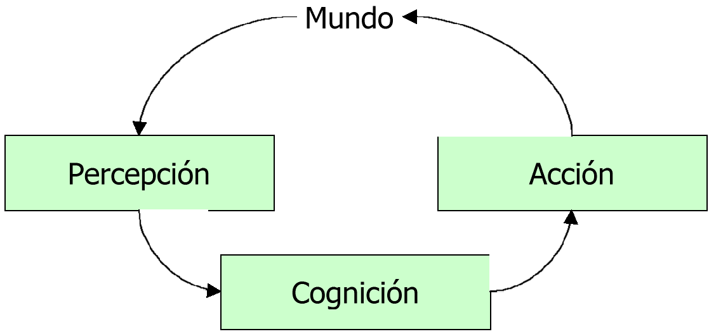
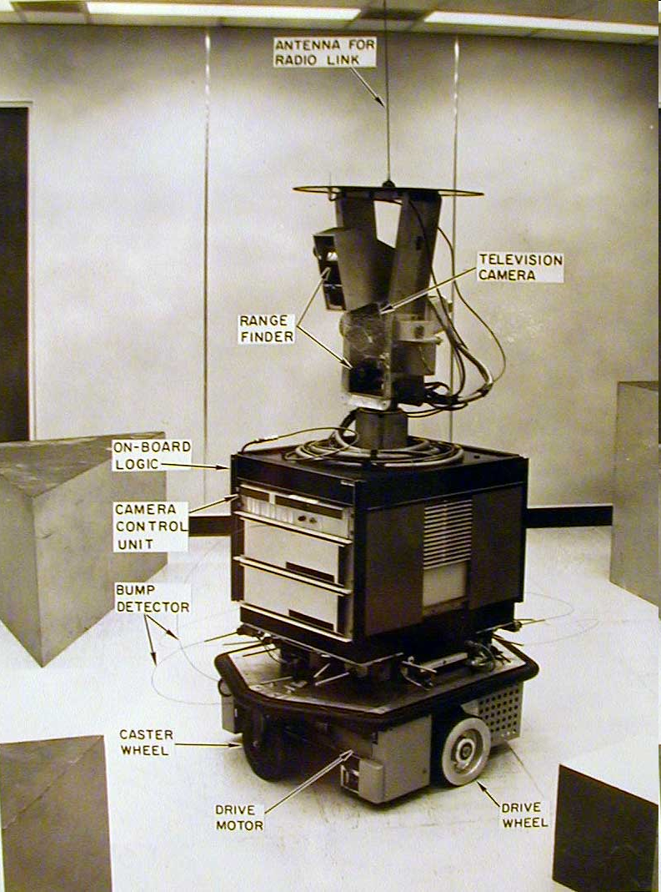
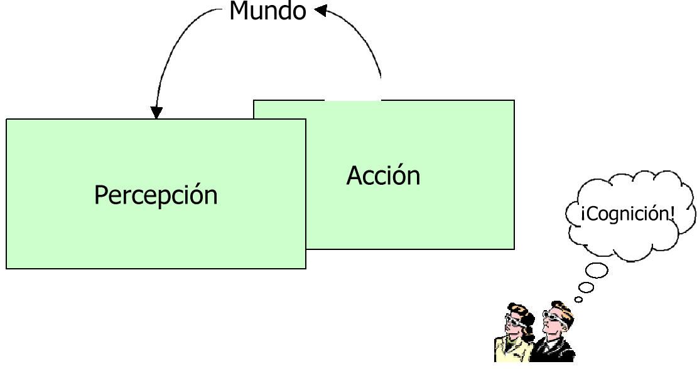
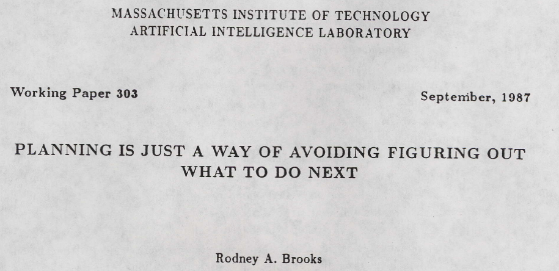

<!-- .slide: class="titulo" -->

# Robots móviles <!-- .element: class="column half" -->

## Tema 6. Parte II. Navegación basada en conductas  <!-- .element: class="column half" -->

---

# Robótica “tradicional”

* Problemas:
    - Obliga a mantener un modelo complejo del mundo y de los objetivos del robot
    - Coste temporal del razonamiento 

 <!-- .element: class="column half" -->
 <!-- .element: class="column half" -->

---

# Sistemas robóticos reactivos

Son sistemas que **acoplan la percepción a la acción**, sin la intervención de representaciones abstractas o memoria histórica

 <!-- .element: class="column half" -->
 <!-- .element: class="column half" -->

---

# Una mirada a la psicología y la biología

* **Conductismo** 
    - La acción viene determinada por los estímulos (perro de Paulov)
* **Etología**: estudio del comportamiento animal
    - Los animales disponen de respuestas casi inmediatas al entorno (hormigas, abejas)
    - Conductas complejas surgen de combinar conductas simples

---

Video de bandada

---

# Ejemplo: bandadas

* Comportamiento complejo (bandada de pájaros) que obedece a la combinación de reglas simples de tipo reactivo
    - Evitar choques
    - Moverse hacia los vecinos 
    - Imitar el movimiento de los vecinos

---

# Características de un sistema reactivo

* Los sistemas son modulares
* No se utiliza conocimiento de alto nivel 
* Respuesta robusta a los cambios dinámicos del entorno
* Se suele copiar el comportamiento animal

---

# Conductas elementales

* Una conducta viene definida por un mapeado entre los sensores (ej: sonar) y los actuadores (ej: motor)
* Seguir-pasillo: 
* Sensores: distancia a los distintos sonares
* Actuadores: modificación de la velocidad lineal y angular

---

# Implementación de conductas

* conducta ejemplo()
* repetir {
* p := percibir_sensores ();
* s := procesar_sensores (p);
* r := calcular_conducta (s);
* Accionar_actuadores (r);
* } hasta fin_conducta();

---

# Dos “Estilos” de robótica reactiva

* Campos de potencial: cada conducta es como un “campo de fuerzas. Se combinan todas
* Subsumción: cada conducta es como una capa del sistema, que influye sobre y colabora con las capas inferiores

---

# Campos de potencial

* Una conducta en un punto genera un vector de movimiento
* Combinar las conductas es sumar vectores
* Una forma de visualizar una conducta es como un “campo de fuerzas”
* En realidad el campo no se calcula entero, solo en el punto en que está el robot
* Es la idea que usamos en la evitación de obstáculos de la práctica 1

---

# Moverse-adelante

---

# Ir-a-objetivo

---

# Ruido-aleatorio

---

# Ir-por-camino

---

# Evitar-obstáculos

---

# Composición de conductas

---

# Coordinación de conductas

* Podemos tener varias conductas activas a la vez en el sistema
* Evitar obstáculo
* Ir a objetivo
* Debemos coordinar la respuesta de las distintas conductas:
* Métodos competitivos
* Métodos cooperativos

---

# Arquitectura subsumption

* Control por niveles
* Cada nivel utiliza elementos del nivel inferior
* Un nivel de competencia superior subsume algunas competencias del nivel inferior
* La adaptación de un sistema a otro supone una adaptación del sistema completo

---

# Ejemplo subsumption

* Nivel 0: evitar obstáculo

---

# Ejemplo subsumption

* Nivel 1: vagabundear

---

# Genghis

* Controlado mediante subsumción por una red de 57 máquinas de estados finitos

---

---

> got vision working! 

---

# Representación de conductas

---

# Diagrama 
estímulo-respuesta

---

# Diagrama de estados finitos

