<!-- .slide: class="titulo" -->

# Robots móviles <!-- .element: class="column half" -->

## Tema 6. Navegación y planificación de trayectorias <!-- .element: class="column half" -->

---

<!-- .slide: class="titulo" -->

# Navegación  <!-- .element: class="column half" -->

## Introducción: ¿qué es navegar? <!-- .element: class="column half" -->

---

## Navegación

Conjunto de técnicas y algoritmos necesarios para que un robot móvil pueda llegar hasta su destino por el **camino más corto** posible y **sin chocar con los obstáculos**

 <!-- .element: class="stretch" -->

---

## Global vs local

- **Navegación global**: encontrar el camino óptimo (más corto o más adecuado) Necesitaremos:
    +  Un **mapa**
    +  Un algoritmo para el **cálculo del camino** óptimo según el mapa
- **Navegación local**: no chocar con obstáculos no reflejados en el mapa. Necesitaremos:
    + Información de los **sensores de rango**
    + Un algoritmo de **evitación de obstáculos**, que calcule la mejor dirección de movimiento para evitarlos (sin alejarnos demasiado del camino óptimo)

---

## Robótica clásica (años 70)

Paradigma *deliberativo* o *jerárquico* : énfasis sobre todo en la **planificación global**

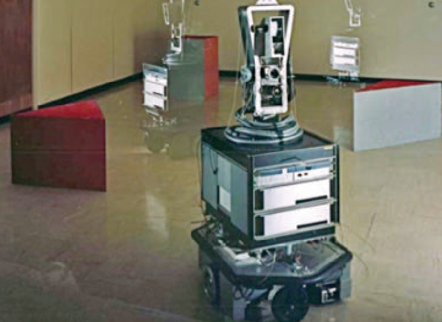 <!-- .element: class="column half" -->
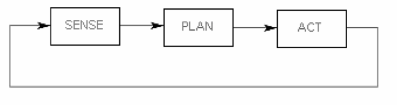 <!-- .element: class="column half" -->

Izquierda: El robot *shakey* (1966-1972), primer robot móvil capaz de planificar sus tareas. Derecha: el ciclo de procesamiento típico del paradigma jerárquico. La información de los sensores se usa sobre todo para elaborar un <strong>plan</strong> 

Notas: 

En el contexto de los experimentos con *shakey* se desarrollaron algoritmos que aún hoy se usan en diversos campos, como el A* en búsqueda de caminos, la transformada de Hough en visión artificial y el método del grafo de visibilidad que veremos un poco más adelante en este mismo tema.

---

## Robótica reactiva (años 80)

"Reacción" a la robótica clásica. **Énfasis en los sensores**, se elimina la planificación global.

 Izquierda: Rodney Brooks, uno de los "popes" de la robótica reactiva. A la derecha, el bucle de control clásico en este paradigma: nótese que no hay planificación  
 <!-- .element: class="caption" -->

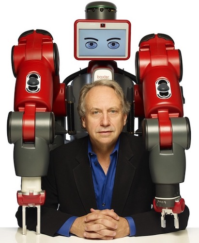 <!-- .element: class="column half" -->
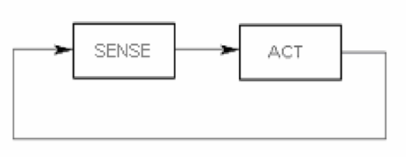 <!-- .element: class="column half" -->

---

## Robótica en la actualidad

**Paradigma híbrido**: se combina la planificación global (proceso de "baja frecuencia") con la local (se ejecuta continuamente)

Tomada del curso <a href="http://ais.informatik.uni-freiburg.de/teaching/ss17/robotics/">Introduction to Mobile Robotics"</a> de Wolfram Burgard
   

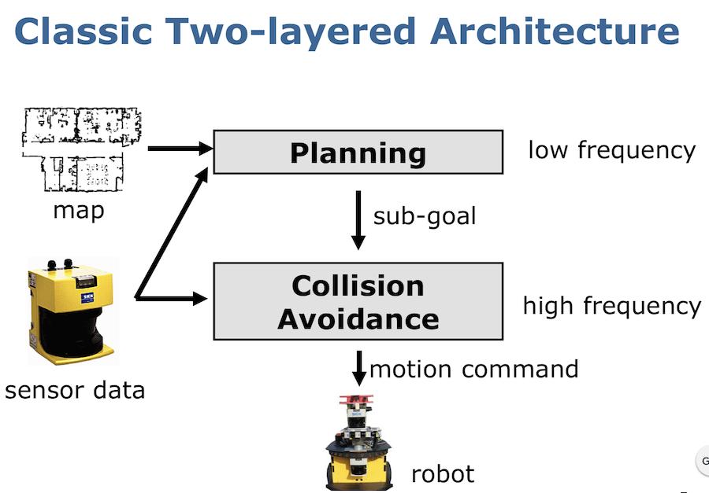 <!-- .element class="stretch" -->

---

## ROS: navegación global (izq.) y local (der.)

Se muestra el *costmap* global y el cálculo del camino,  y el *costmap* local

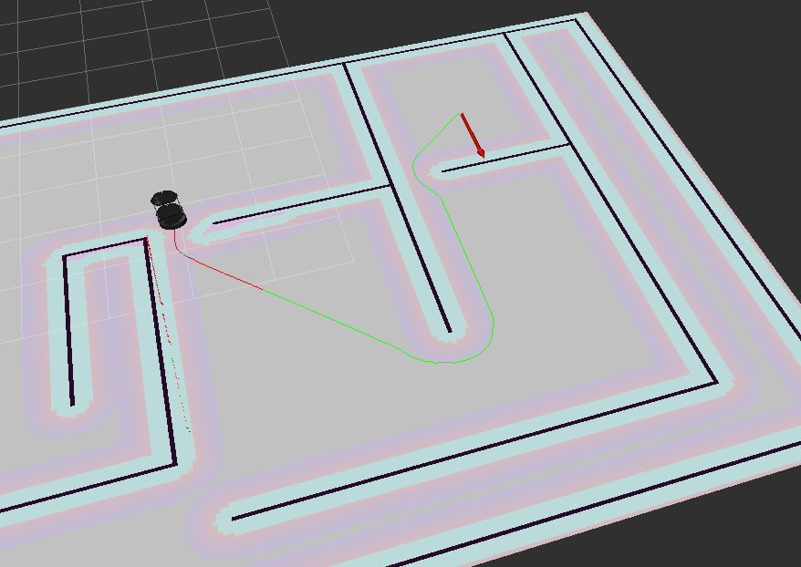 <!-- .element: class="column half" -->
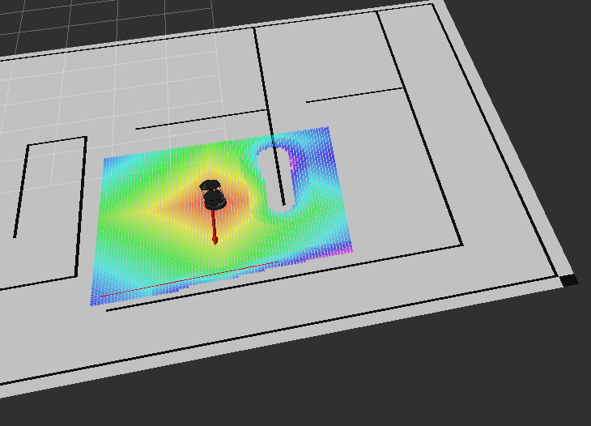 <!-- .element: class="column half" -->

Notas:

Como veremos, en ROS se discretiza el espacio en una rejilla y se crea un *costmap* local y uno global, al estilo de las rejillas de ocupación. En cada celda de este "mapa" se almacena el "coste" que tiene para el robot pasar por ella. Costes altos indican que el robot no debería pasar por ahí. 

En el *costmap* global los costes altos están en las zonas ocupadas del mapa y alrededor de ellas, ya que el robot no solo debe evitar chocar contra la pared, además no debe acercarse demasiado, ya que al haber una incertidumbre en la localización podría chocar. 

El *costmap* local se actualiza con la información de los sensores de rango. En este último los colores cálidos indican una zona apropiada para moverse (coste bajo) y los fríos una zona a evitar (coste alto).

---

## El *stack* de navegación en ROS

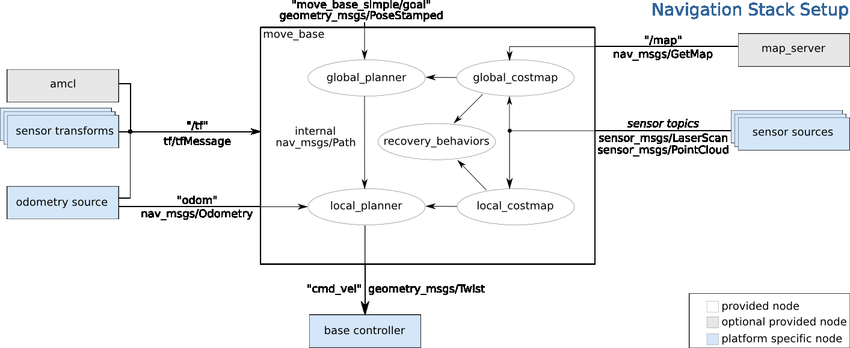 <!-- .element: class="stretch" -->

---

<!-- .slide: class="titulo" -->

# Planificación global  <!-- .element: class="column half" -->

## Cálculo del camino más "corto" <!-- .element: class="column half" -->

---

La gran mayoría de algoritmos de cálculo de rutas trabajan en el **espacio de configuraciones** o CSpace: el espacio formado por las posibles poses del robot

- Tantas dimensiones como grados de libertad tenga el robot
- Buscamos una ruta en este espacio que solo pase por espacio libre

Es un concepto habitual en planificación de movimiento de brazos robot ([Demo](https://www.cs.unc.edu/~jeffi/c-space/robot.xhtml))

---

## CSpace para robots móviles

Típicamente la *pose* se define con $(x,y,\theta)$, lo que daría un CSpace 3D. 

No obstante, vamos a hacer simplificaciones:

- **Ignoraremos la ~$\theta$~**  (el CSpace se queda en 2D). Esto podemos hacerlo si el robot es *holonómico*, es decir puede seguir cualquier trayectoria en el CSpace.
- Podemos suponer que **el robot es un punto**, si **"dilatamos" los obstáculos** al menos en un tamaño igual al radio del robot

---

La operación de dilatación que necesitamos ha sido formalizada en diferentes campos de las matemáticas:
- *Suma de Minkowski* de la forma del robot y los obstáculos 
- En *morfología matemática* la operación se denomina también [*dilatación*](https://es.wikipedia.org/wiki/Morfolog%C3%ADa_matemática#Dilatación)

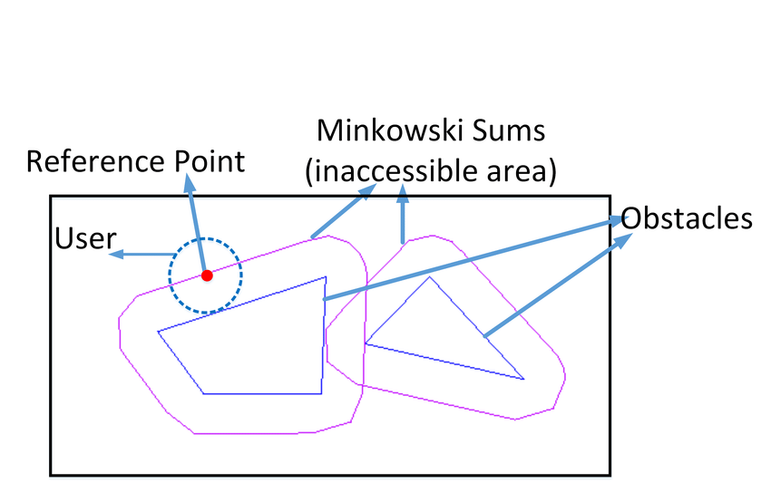 <!-- .element: class="stretch" -->

---

En ROS se aplica la misma idea, generando un *costmap* llamado *inflation costmap*

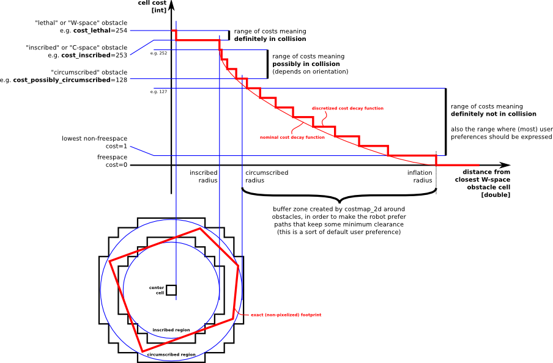 <!-- .element: class="stretch" -->

---

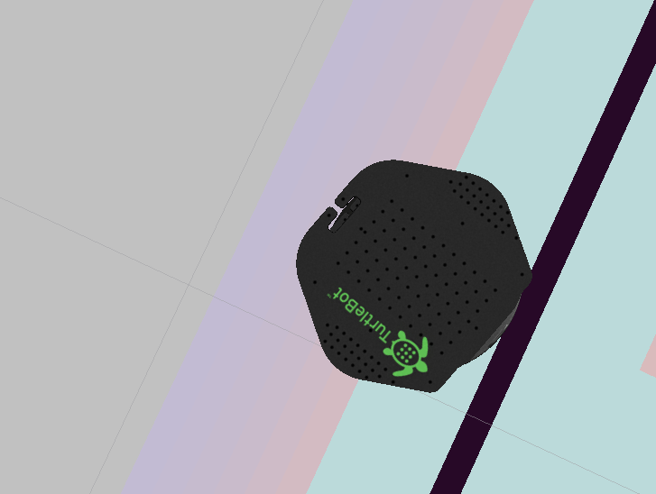 <!-- .element: class="stretch" -->

---

## Búsqueda del camino más corto

Hay infinitos caminos posibles entre un origen y un destino, pero el espacio de búsqueda no puede ser infinito, hay que *restringirlo*. Normalmente:

1. Transformar el CSpace en un grafo que contenga todos los caminos a considerar.
2. Aplicar algún algoritmo de búsqueda de camino más corto en grafos.

---

## Conversión del CSpace en un grafo

Dependerá de la representación del mapa:

- *Mapas poligonales*: varias formas:
    + Grafo de visibilidad
    + Grafo de voronoi
- *Rejillas de ocupación*: cada celda será un nodo, conectado con sus 8 vecinos más inmediatos. 

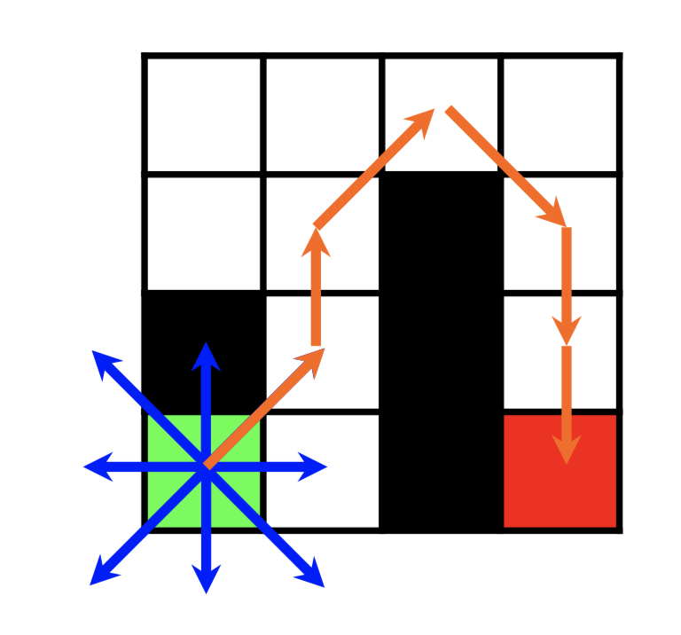 <!-- .element: class="stretch" -->

---

## Grafo de visibilidad

Grafo cuyos nodos son los vértices de los polígonos, y los arcos las conexiones entre ellos que no intersectan ningún obstáculo.

Tomado de <a href="https://www.slideshare.net/GauravGupta527/visibility-graphs">https://www.slideshare.net/GauravGupta527/visibility-graphs</a>

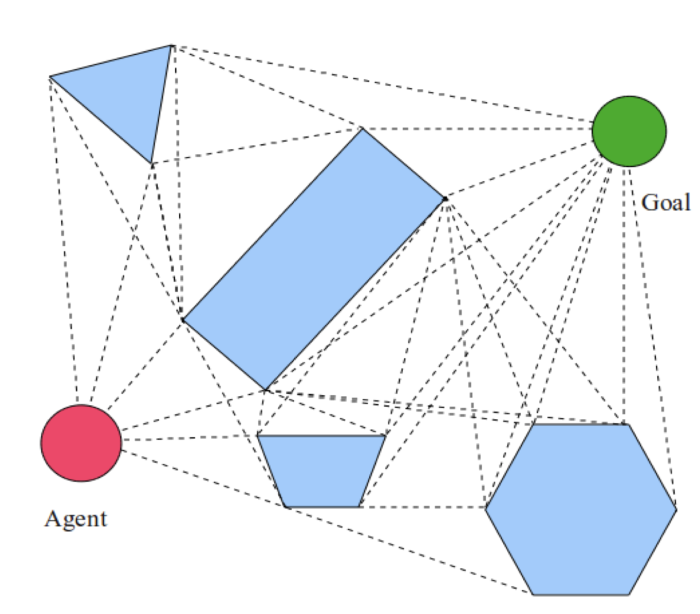 <!-- .element: class="stretch" -->

---

## Diagramas de Voronoi

Formado maximizando la distancia mínima a los obstáculos (todos los puntos con la misma distancia mínima a dos o más objetos)

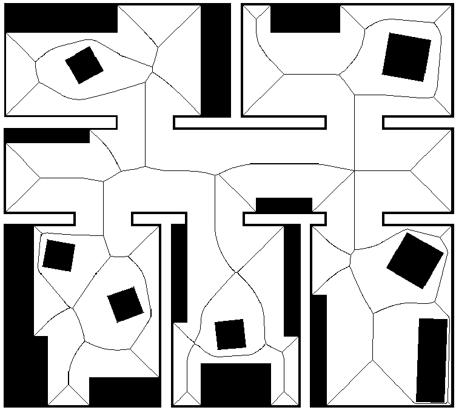 <!-- .element: class="stretch" -->

- No nos va a dar los caminos más cortos
- Al maximizar la distancia a los objetos, maximizamos la seguridad 

---

## Algoritmos de búsqueda de camino más corto

- Algoritmos clásicos de búsqueda en grafos: el más típico es **Dijkstra**
- Guiados por heurísticas: el más usado es `A*`, aunque hay otros similares, como `D*`

---

## A*

- La búsqueda se guía por un $f(n)$ para cada nodo: $f(n) = g(n) + h(n)$, siempre expandimos por el nodo de menor $f(n)$
    + $g(n)$: coste del camino ya recorrido
    + $h(n)$ una heurística *admisible* (== una estimación "optimista") para el camino que queda

Demo: [http://qiao.github.io/PathFinding.js/visual/](http://qiao.github.io/PathFinding.js/visual/)

---

## Pseudocódigo A*

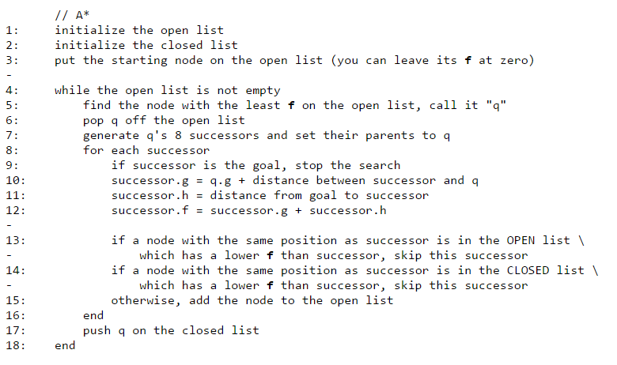 <!-- .element: class="stretch" -->

---

## Otros algoritmos: D* y D* lite

- Similares a A*, aunque parten del destino en lugar del origen
- Pueden *replanificar* trayectorias: pueden "reparar" la trayectoria de modo incremental si hay cambios en el grafo 

---

- Los *rover* de Marte necesitan autonomía dado el retardo de la señal Tierra-Marte (entre 3-22 min) 
- Usan un mapa de costes de rejilla y una versión modificada del algoritmo `D*` para calcular el camino más corto. 

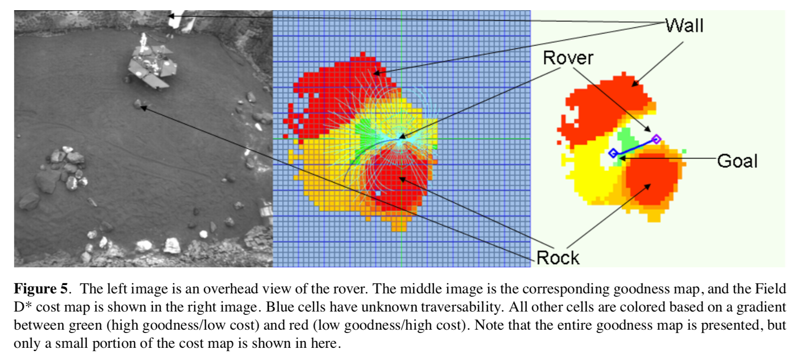 <!-- .element: class="stretch" -->

---

## Búsqueda del camino más corto en ROS

Paquete `global_planner`, implementa Dijkstra y A*, seleccionables cambiando el parámetro `use_dijkstra`

---
